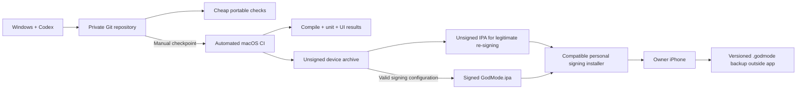

# Architecture

## Pattern and ownership

Feature-oriented Clean Architecture with MVVM presentation and a **local repository pattern**. Views → observable MainActor presentation models → use cases/domain services → protocol repositories → SwiftData/system adapters. Domain values are Sendable; persistent objects never escape their context. UI and rendering do not decide rewards or progression.

```
GodMode.xcodeproj/              app, unit tests, UI tests, shared scheme
GodMode/App/                   composition root and launch failure handling
GodMode/DesignSystem/          semantic tokens and shared primitives
GodMode/Features/              shell, setup, catalog; later workout/RPG features
GodMode/Data/                  versioned schemas, local repositories
GodMode/Resources/             privacy manifest, localization, assets
Packages/GodModeCore/          Foundation-only domain and bundled catalog
GodModeTests/                  Apple persistence and presentation tests
GodModeUITests/                accessibility-aware critical flow tests
tools/                        portable checks, checkpoint CI and personal packaging
.github/workflows/             Apple build/test CI
```

## Persistence options considered

| Option | Reads/writes and ownership | Cost and limits |
| --- | --- | --- |
| Local repository + normalized SwiftData | Owner edits profile/session/set records; transactions and bounded indexed history queries | Chosen. No service operation cost; explicit migrations and later sync reconciliation needed |
| Local repository + opaque Codable session blobs in SwiftData | Owner replaces an entire session snapshot | Simpler for a disposable single-session demo; poor set analytics, large rewrites and harder conflict merging |
| Local repository + private CloudKit mirroring | Same local writes plus asynchronous replication to owner's iCloud | Future optional module outside Personal Edition V1; entitlement/schema/conflict testing required |

**Why this approach:** local repositories keep training responsive and testable without network or Apple rendering frameworks. `profileRepository.save(profile)` returns only after save; catalog reads decode/validate a bundled immutable resource. Local owner isolation uses the device sandbox. There are no REST routes, server auth, or account credentials to operate.

**Simpler alternative:** JSON files suffice for a catalog-only viewer. They give up SwiftData queries and planned migration support for mutable training data.

## Composition and failure handling

App composition constructs one versioned local ModelContainer, one profile repository and one catalog repository. M1 explicitly opts out of automatic CloudKit discovery. Load the catalog on an async task; errors render Retry. Store-open failures preserve the store and present Retry; never use `try!`, delete the database, or silently fall back to memory. UI tests use a distinct ephemeral container through a DEBUG-only launch switch; production has no reset/sample-data switches.

M2/M3: serialize active-session commands; idempotent command identifiers; persist set and cursor/rest state together; apply observable UI after successful commit. Cancellation is not rollback after a successful write. Separate game transactions consume committed workout facts. External effects use persisted outbox entries and retry, not awaited remote calls in a workout transaction.

## Planned modules

### Workout command boundary (M2)

The established local repository remains the persistence boundary. M2 uses a pure **command/state-machine pattern**: `apply(completeSet, snapshot, clock) → proposed snapshot + events`. One local owner writes a small active session; relationships between prescribed steps, results, draft and rest must change together. M3 serializes commands and persists the proposal before UI acknowledgement. No remote authentication/API is introduced.

| Domain option | Fit and tradeoff |
| --- | --- |
| View-model methods mutating fields directly | Simpler for a disposable set counter; UI lifecycle and save errors can leave fields inconsistent, so insufficient for restoration/retry guarantees. |
| Pure command/state reducer with repository commit | Chosen: deterministic tests, immutable prescription snapshot, explicit command IDs/revisions, one coherent proposed update. Requires a validated M3 adapter and receipt retention. |
| Full event-sourced replay | Can rebuild all state from history, but replay/migration and log growth add complexity without a current multi-device or audit-reconstruction requirement. Revisit only if that requirement becomes real. |

**Why this approach:** the reducer makes illegal transitions and duplicate writes testable without Apple UI/storage. Revisions prevent stale UI edits and command receipts prevent retry duplication. The simpler direct-mutator alternative would suffice only for a temporary, nonpersistent counter. No persistence success, cross-session exclusivity or reward delivery is claimed by the reducer; those remain repository/ledger responsibilities. Size limits bound local work and journal growth; session loading will require validated DTOs, not blind Codable hydration.

**Concepts used here:** A state machine allows only valid changes between workout states. Optimistic concurrency rejects commands prepared from an old revision. Idempotency means an exact retry produces no second effect. A transaction will make the M3 storage update succeed or fail as one unit.

Workout/Schedule/Progression/Analytics are fitness domain services. RPGProgression/Quest/Reward/Achievement/Character/Inventory consume fitness facts. AssetManager and PerformanceManager own scene resources/adaptation. SystemCapabilities separates build inclusion, OS/device support, entitlement configuration and user authorization. HealthKit, LiveActivity, Notification, Haptic and AppIntent adapters are optional. CloudSyncService is a future boundary with no V1 implementation. App extensions receive minimal read models through a protected App Group only when both implemented and available.

## Personal Edition build and data paths



BackupService exports a consistent domain snapshot through LocalRepository, validates/migrates imports before writes, creates a safety snapshot and replaces records transactionally. Portable IDs, not certificate identities, join records. DiagnosticsService maintains a bounded redacted event buffer and exports an explicit user-approved report. See `BACKUP_SYSTEM.md` for persistence alternatives and `CI.md` for independent build/signing states. No Apple account credentials belong in the app.

## Security/scaling foot-guns

CloudKit sync is not a globally serial transaction boundary: a UUID alone cannot prevent two devices rewarding the same scheduled occurrence. Use deterministic occurrence keys and reconcile a ledger; keep this unresolved until sync is tested. Avoid full-history fetches and storing models/textures inside SwiftData. Device compromise can alter a local game ledger; V1 makes no competitive anti-cheat claim. No secrets, workout values or HealthKit samples in logs.

**Concepts used here:** Dependency injection passes services explicitly so tests can replace them. A repository hides storage details behind domain operations. A transaction commits related writes together. Idempotency makes a retry have the same effect as a single successful command.

## Platform references

- [Apple Xcode requirements](https://developer.apple.com/xcode/system-requirements)
- [Xcode 26 release notes](https://developer.apple.com/documentation/xcode-release-notes/xcode-26-release-notes)
- [SwiftData VersionedSchema](https://developer.apple.com/documentation/swiftdata/versionedschema)
- [SwiftData SchemaMigrationPlan](https://developer.apple.com/documentation/swiftdata/schemamigrationplan)
